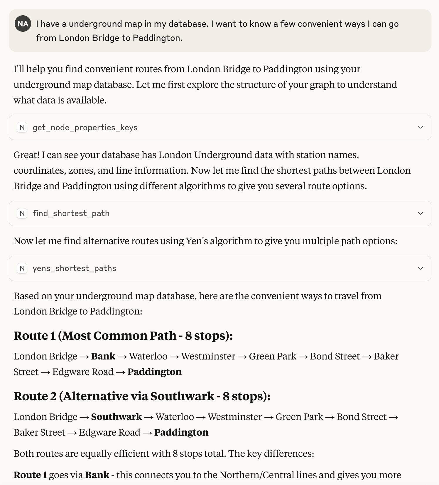
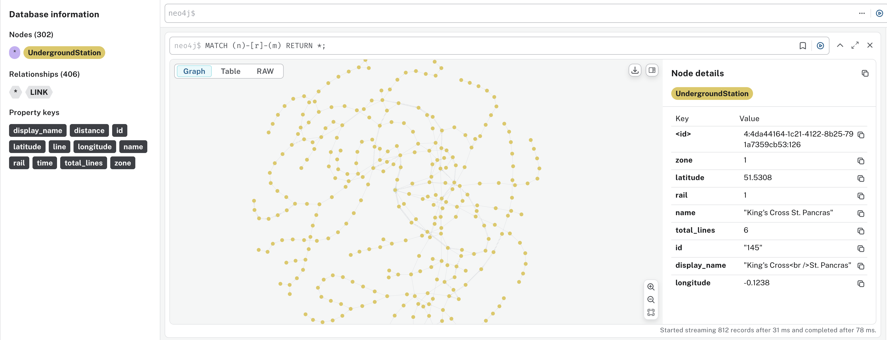

# GDS Agent

Neither LLMs nor any existing toolings (MCP Servers) are capable of complex reasoning on graphs at the moment.

This MCP Server includes toolings from Neo4j Graph Data Science (GDS) library, which allows you to run all common graph algorithms.

Once the server is running, you are able to **ask any graph questions about your Neo4j graph** and get answers. LLMs equipped with GDS agent can decide and accurately execute the appropriate parameterised graph algorithms over the graph you have in your Neo4j database.

An example where an LLM with GDS Agent is able to pick shortest path and Yen's algorithm to answer my question about travel plan:


# Table of Contents

## For Users
- [Use GDS Agent](#use-gds-agent)

## For Developers
- [Example dataset](#example-dataset)
- [Start the server](#start-the-server)
- [How to contribute](#how-to-contribute)
- [Feature request and bug reports](#feature-request-and-bug-reports)


# Use GDS Agent
If you have `uvx` install, add the following config to your `claude_desktop_config.json`
```
{
    "mcpServers": {
      "neo4j-gds": {
      "command": "/opt/homebrew/bin/uvx",
      "args": [ "gds-agent" ],
      "env": {
        "NEO4J_URI": "bolt://localhost:7687",
        "NEO4J_USERNAME": "neo4j",
        "NEO4J_PASSWORD": ""
      }
    }
    }
}
```
Replace command with your `uvx` location. Find out by running `which uvx` in the command line.
Replace `NEOJ_URI`, `NEO4J_USERNAME`, `NEO4J_PASSWORD` with your database login details. You can also optionally specify `NEO4J_DATABASE`.


# Example dataset
To load the London underground example dataset:
1. Fork and clone the repository
2. Install necessary packages in your python environment with `pip install -r requirements.txt`
3. Install the Neo4j database with GDS plugin:
   Download the Neo4j Desktop from [Neo4j Download Center](https://neo4j.com/download/)
   Install the GDS plugin from the Neo4j Desktop
   Create a new database and start it
4. Populate .env file with necessary credentials:
   ```bash
   NEO4J_URI=bolt://localhost:7687  # or other database URL if running in Aura
   NEO4J_USERNAME=neo4j  # or other customer name
   NEO4J_PASSWORD=your_password
   ```
5. Load the London Underground dataset with the following command:
   ```bash
   python import_data.py
   ```
Connect to your DB and querying the graph from [Neo4j workspace](https://workspace-preview.neo4j.io/workspace/), 
you should see:



# Start the server for dev
1. When inside the `/mcp_server` folder, run `uv sync --dev` and run `uv run gds-agent` to start the MCP server standalone, or run `claude` to start claude-cli with the agent.


# How to contribute
Open a pull request from a branch of your forked repository into the main branch of this repo, for example `mygithubid:add-new-algo -> neo4j-contrib:main`.

The CI build in github action requires all codestyle checks and tests to pass.

To run and fix codestyle checks locally, in the `/mcp_server` directory, run:
```bash
uv sync --dev
```
to setup the python environment. And then,
```bash
uv run pytest tests -v -s
uv run ruff check
uv run ruff format
```
for all tests and codestyle fixes.

# Feature request and bug reports
To report a bug or a new feature request, raise an issue.
If it is a bug, include the full stacktrace and errors.
When available, attach relevant logs in `mcp_server_neo4j_gds.log`. This file is located inside the `/mcp_server/src_mcp_server_neo4j_gds` directory if the gds agent is running from source, or inside the logging path for Claude (e.g `/Library/Logs/Claude` for Claude Desktop on Mac). Include relevant minimal dataset that can be used to reproduce the issue if possible.